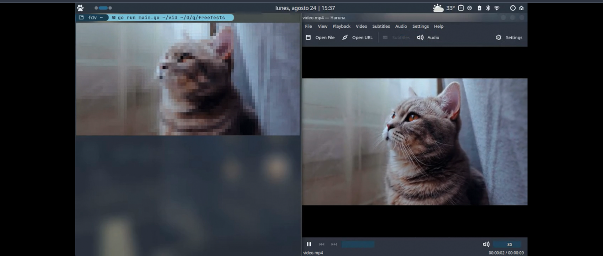

# ANSI-Vid

## Render your video as ANSI art in the terminal.

### Requirements
- [Go](https://go.dev/)
- [Ffmpeg](https://www.ffmpeg.org/)

### Project Set-up

- `git clone git@github.com:swampPr/ansi-vid.git`
- `cd ./ansi-vid`
- `go build`
- `go install`
- `ansi-vid --help`

### Example

`ansi-vid ./video.mp4`

